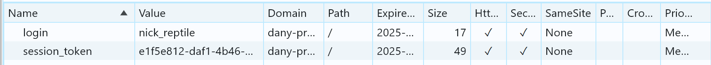

<a id="readme-top"></a>

<br />
<div align="center">
  <a href="https://github.com/othneildrew/Best-README-Template">
    
  </a>

  <h3 align="center">Дэни. Голоса в голове</h3>

  <p align="center">
    Браузерная онлайн-игра с базой данных и real-time соединением!
    <br />
    <a href="https://t.me/alinachnnl/227"><strong>Посмотреть видео-обзор »</strong></a> 
    <br />
    <br />
    <a href="https://danygame.vercel.app/">Перейти к игре</a>
    &middot;
    <a href="https://github.com/everythingiam/dany/issues/new?labels=bug&template=bug-report---.md">Сообщить об ошибке</a>
  </p>
</div>


<!-- TABLE OF CONTENTS -->
<details>
  <summary>Оглавление</summary>
  <ol>
    <li>
      <a href="#о-проекте">О проекте</a>
      <ul>
        <li><a href="#правила-игры">Правила игры</a></li>
        <li><a href="#стек-технологий">Стек технологий</a></li>
      </ul>
    </li>
    <li>
      <a href="#особенности">Особенности</a>
      <ul>
        <li><a href="#авторизация-и-смена-аватара">Авторизация и смена аватара</a></li>
        <li><a href="#чат-на-websocket">Чат на WebSocket</a></li>
        <li><a href="#карточный-канвас-на-websocket">Карточный канвас на WebSocket</a></li>
      </ul>
    </li>
    <li>
      <a href="#getting-started">Установка</a>
      <ul>
        <li><a href="#запуск-фронтенда">Запуск фронтенда</a></li>
        <li><a href="#запуск-бэкенда">Запуск бэкенда</a></li>
      </ul>
    </li>
    <!-- <li>
      <a href="#database">База данных</a>
      <ul>
        <li><a href="#model">Проектирование</a></li>
        <li><a href="#logic">Логика</a></li>
      </ul>
    </li>
    <li>
      <a href="#backend">Бэкенд</a>
      <ul>
        <li><a href="#server">Сервер</a></li>
        <li><a href="#api">API</a></li>
      </ul>
    </li>
    <li>
      <a href="#frontend">Фронтенд</a>
      <ul>
        <li><a href="#front-data">Синхронизация данных</a></li>
        <li><a href="#canvas">Карточное поле</a></li>
      </ul>
    </li> -->
    <li><a href="#контакты">Контакты</a></li>
  </ol>
</details>


<!-- ABOUT THE PROJECT -->
## О проекте


**Онлайн-игра**, выполненная в формате фуллстек-приложения, где вся игровая логика реализована на стороне базы данных и сервера.  
Игроки взаимодействуют с сервером в реальном времени через **WebSocket** и периодические **API-запросы**.
<br>
<br>
Проект является цифровой версией существующей <a href="https://gaga.ru/gaga/files/pdf/rules/ru/5252.pdf?clckid=c13f7084">одноимённой карточной игры</a>, и был разработан в рамках курса «Базы данных для игровых приложений» от Университета ИТМО.


<p align="right">(<a href="#readme-top">наверх</a>)</p>


### Правила игры
Если коротко: каждый раунд активный игрок изображает слово с помощью случайных абстрактных карт, а остальные игроки пытаются угадать, что это за слово. Можно найти схожесть с «крокодилом», только это очень странный «крокодил».
<br>Дэни в данном случае является «мафией», которая путает других игроков, неправильно показывает слова и обманывает. 

<p align="right">(<a href="#readme-top">наверх</a>)</p>


### Стек технологий


* 
* 
* 
* 
* 
* 
* [](https://mobx.js.org/)  
* [](https://axios-http.com/)  
* [](https://fabricjs.com/)  


<p align="right">(<a href="#readme-top">наверх</a>)</p>


## Особенности

### Авторизация и смена аватара
Токен express сессии на 1 неделю генерируется на сервере, заносится в базу данных и отправляется на клиент в Cookie. При каждом другом приватном запросе этот токен тоже отправляется в API для проверки сессии. При регистрации пароль, конечно, хешируется.
<br> 
<br> 
<!--  -->
<!--  -->


<p align="right">(<a href="#readme-top">наверх</a>)</p>


### Чат на WebSocket 
<!--  -->
Помимо сообщений игроков в чате присутствуют сообщения о состоянии игры, данные которой идут из базы данных. Так пользователю понятнее, что происходит в игре.
<br>
<br>

<p align="right">(<a href="#readme-top">наверх</a>)</p>

### Карточный канвас на WebSocket 
Игроку предстоит показать картами слово, которое ему выпало.
<br>С помощью библеотеки `fabric.js` был реализован JS-класс для управления картами. Каждый раунд управлять ими может только 1 клиент, а другие наблюдать за изменениями в **реальном времени**. 
<br>Можно крутить карту, менять её рубашку, и положение. А при каждом изменении все координаты сохраняются в `localStorage`, чтобы при обновлении страницы сразу синхронизировать положение.
<br>Правда, из-за того, что игра задеплоена в Америке, процесс иногда немного тормозит...
<br>
<br>

<p align="right">(<a href="#readme-top">наверх</a>)</p>


<!-- GETTING STARTED -->
## Установка
> [!IMPORTANT]  
> Убедитесь, что на вашем компьютере устновлен node.js и последняя версия npm:
>  <br>`npm install npm@latest -g`

Склонируйте себе репозиторий
   ```sh
   git clone git@github.com:everythingiam/dany.git
   ```
### Запуск фронтенда 


1. Перейдите в папку с клиентской частью
   ```js
   cd client
   ```   
2. Установите все зависимости
   ```sh
   npm install
   ```
3. Введите адрес API для HTTP и WS протоколов в `config.js`
   ```sh
   API_BASE_URL: "https://YOUR_API",
   WS_URL: "wss://YOUR_API"
   ```
4. Запустите комнадой
   ```sh
   npm run dev
   ```
<p align="right">(<a href="#readme-top">наверх</a>)</p>

### Запуск бэкенда 

_Чтобы развернуть проект на своём комьютере или на удалённом сервере, придётся вписать свои переменные для подключения и инициализировать логику на SQL._

1. Перейдите в папку с серверной частью
   ```js
   cd server
   ```
2. Установите все зависимости
   ```sh
   npm install
   ```
3. Перейдите в файл .env и замените секретные значения на свои собственные
   ```sh
    SERVER_PORT=2024
    CLIENT_PORT=2025
    DB_USER=postgres
    DB_PASSWORD=*****
    ...
   ```
> [!IMPORTANT]  
> Убедитесь, что у вас установлен PostgreSQL (или другя СУБД).
> <br>`psql --version`

4. Создайте базу данных
   ```sh
   createdb my_database
   ```
5. Импортируйте структуру таблиц из файла database/init.sql
   ```sh
   psql -U your_user -d my_database -f database/init.sql
    ```
6. Запустите сервер комнадой
   ```sh
   npm run dev
   ```

<p align="right">(<a href="#readme-top">наверх</a>)</p>


<!-- CONTRIBUTING -->
## Контрибьюшен

Любой контрибьюшен **очень ценен**.

Если у вас есть предложения того, как сделать этот проект лучше, то сделайте fork репозитория и pull request. Не забудьте поставить звёздочку.. Спасибо!

1. Сделайте fork проекта
2. Создайте свою ветку (`git checkout -b feature/AmazingFeature`)
3. Закоммитьте изменения (`git commit -m 'Add some AmazingFeature'`)
4. Отправьте их в свою ветку (`git push origin feature/AmazingFeature`)
5. Отправьте Pull Request

<p align="right">(<a href="#readme-top">наверх</a>)</p>


<!-- CONTACT -->
## Контакты

Михайлова Алина - [t.me/a_li_nus](https://t.me/a_li_nus) - alina.mikhaylova.03@mail.ru

Ссылка проекта: [https://github.com/everythingiam/dany](https://github.com/everythingiam/dany)

<p align="right">(<a href="#readme-top">наверх</a>)</p>


